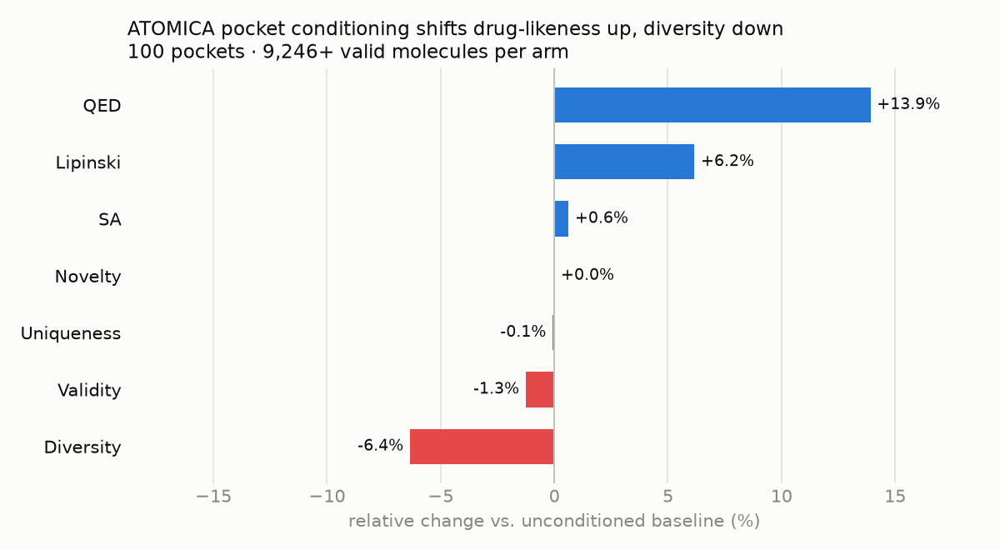

# ATOMICA-Diffusion

**Does conditioning a structure-based diffusion model on a pretrained *interaction*
representation, instead of raw pocket geometry, produce better molecules?**

This repository couples [ATOMICA](https://github.com/mims-harvard/ATOMICA) — a
foundation model pretrained on ~2M molecular interaction interfaces — to
[DiffSBDD](https://github.com/arneschneuing/DiffSBDD), an SE(3)-equivariant
diffusion model for de novo ligand design, through a single SE(3)-equivariant
cross-attention adapter. Both pretrained models are frozen, so the measured effect
isolates the conditioning signal itself.

The application target is PBP3 in multidrug-resistant ESKAPE pathogens
(*A. baumannii*, *P. aeruginosa*, *K. pneumoniae*); the benchmark below is
CrossDocked.

## Result

Two arms over the same 100 held-out pockets, ~9,300 valid molecules each. Arm B
adds the adapter to arm A's frozen backbone; since the adapter is zero-initialised,
both arms start from identical behaviour.



| Metric | A — baseline | B — ATOMICA-conditioned | Δ |
| --- | --- | --- | --- |
| **QED** | 0.424 ± 0.214 | **0.483 ± 0.208** | **+0.059** (+13.9%) |
| Lipinski | 4.417 ± 0.970 | 4.690 ± 0.696 | +0.273 (+6.2%) |
| SA | 0.581 ± 0.130 | 0.585 ± 0.112 | +0.004 |
| Validity | 0.962 | 0.950 | −0.012 |
| Diversity | 0.731 ± 0.042 | 0.684 ± 0.025 | −0.046 (−6.4%) |
| Novelty | 1.000 | 1.000 | ≈ |

Conditioning shifts the generated distribution toward drug-likeness, at a measurable
cost in diversity.

**The honest caveat:** QED, SA and Lipinski are computed from the ligand alone — they
do not know which pocket it was generated for. So this result cannot yet distinguish
"better pocket-specific fit" from "the adapter narrowed the model toward generically
drug-like chemistry," and the diversity drop is consistent with the latter. The
decisive experiment is a matched Vina comparison across both arms on the same
pockets, which has not been run. See [docs/results.md](docs/results.md).

Reproduce the table:

```bash
python scripts/compare_conditions.py \
    --conditions results/baseline_A results/cond_B --outdir results
```

## How it works

One cross-attention block inside each denoising step of DiffSBDD's `EGNNDynamics`:

| | |
|---|---|
| **Query** | ligand scalar features ⊕ 16-d timestep embedding |
| **Key / Value** | frozen ATOMICA per-atom pocket embeddings |
| **Output** | delta on ligand *invariant scalar* features only |

Equivariance is preserved by construction: ATOMICA embeddings are rotation-invariant
scalars, and the module reads and writes only invariant features — coordinates never
enter the attention computation, so no frame dependence can be introduced. Ragged
batching with a block-diagonal mask handles variable-sized pockets without padding
artifacts.

Details in [docs/method.md](docs/method.md).

## Repository layout

```
DiffSBDD/          vendored fork — modified (see MODIFICATIONS.md)
ATOMICA/           vendored upstream — unmodified, used as frozen encoder
scripts/           preprocessing, evaluation, comparison
  eval/            "three judges" pipeline: PAINS, Vina, Boltz-2
rl_loop/           post-generation ADMET scoring / REOS filter / top-k selection
results/           per-condition metrics and the ablation summary
docs/              method and results write-ups
```

`DiffSBDD/` is a **modified fork**, not a pinned dependency —
[MODIFICATIONS.md](MODIFICATIONS.md) itemises all 853 changed lines across 11 files
and what each one does, so the boundary between upstream code and this project's
contribution is inspectable. Licensing and attribution for both vendored projects
are in [THIRD_PARTY_NOTICES.md](THIRD_PARTY_NOTICES.md).

## Setup

Training and inference run in the conda environment; the newer Poetry environment
covers scripts that need Boltz-2 and OpenBabel.

```bash
conda env create -f DiffSBDD/environment.yaml && conda activate diffsbdd
# optional, for the deep-dive evaluation scripts
pip install poetry && poetry install
```

## Usage

All commands run from the repository root.

**Preprocess** — filter CrossDocked and precompute ATOMICA embeddings:

```bash
python scripts/process_expert_atomica.py
```

**Train** — the ATOMICA-conditioned model:

```bash
cd DiffSBDD && python train.py --config configs/crossdock_fullatom_cond.yml
```

**Generate** — de novo ligands for a target pocket:

```bash
python DiffSBDD/generate_ligands.py checkpoints/crossdocked_fullatom_cond.ckpt \
    --pdbfile example/5ndu.pdb --ref_ligand example/5ndu_linked_mols.sdf \
    --atomica_config ATOMICA/pretrain/pretrain_model_config.json \
    --atomica_weights ATOMICA/pretrain/pretrain_model_weights.pt \
    --outfile generated_ligands.sdf
```

Add `--no_atomica` to reproduce the arm-A baseline.

**Evaluate and compare arms:**

```bash
python scripts/evaluate.py --sdf_dir results/cond_B --label cond_B
python scripts/compare_conditions.py --conditions results/baseline_A results/cond_B
```

More entry points, including the evolutionary ADMET loop, are in
[run_scripts.md](run_scripts.md).

## Status

All four ablation arms were trained, but only A and B were sampled and evaluated,
so the comparison above is A vs B. Two of the remaining arms are not what their
names suggest: C is architecturally identical to B, and D is full backbone
fine-tuning rather than LoRA — see
[MODIFICATIONS.md](MODIFICATIONS.md#status-of-the-planned-ablation-arms).
Outstanding runs are tracked in [run_scripts.md](run_scripts.md).

**The conditioning signal was mis-extracted.** ATOMICA is pretrained on two
interacting segments over chemically-typed residue blocks; preprocessing fed it a
single segment with the whole pocket as one `UNK` block, engaging none of its
interaction semantics. The result above is therefore best read as a negative result
for naively-extracted foundation-model embeddings. [docs/experiment-plan.md](docs/experiment-plan.md)
sets out the redesign, beginning with a go/no-go test of whether ATOMICA
discriminates binders from decoys at all.

Raw generated structures (~46 MB of SDF per arm) are not versioned; the per-condition
metrics that summarise them are.

## License

MIT — see [LICENSE](LICENSE). Vendored dependencies retain their own MIT licenses;
see [THIRD_PARTY_NOTICES.md](THIRD_PARTY_NOTICES.md).

## Citing

If you use this work, please cite the ATOMICA and DiffSBDD papers
([THIRD_PARTY_NOTICES.md](THIRD_PARTY_NOTICES.md)) alongside this repository — see
[CITATION.cff](CITATION.cff).
